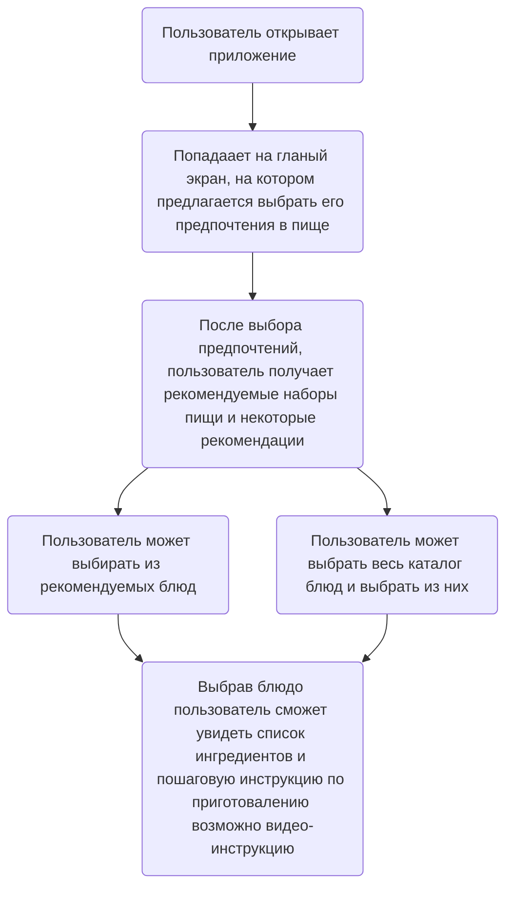

```mermaid
graph TD;
A(Пользователь открывает приложение) --> B
B(Попадаает на гланый экран, на котором предлагается выбрать его предпочтения в пище) --> C
C(После выбора предпочтений, пользователь получает рекомендуемые наборы пищи и некоторые рекомендации) --> D(Пользователь может выбирать из рекомендуемых блюд)
C(После выбора предпочтений, пользователь получает рекомендуемые наборы пищи и некоторые рекомендации) --> E(Пользователь может выбрать весь каталог блюд и выбрать из них)
D-->F
E-->F(Выбрав блюдо пользователь сможет увидеть список ингредиентов и пошаговую инструкцию по приготовалению возможно видео-инструкцию)
```
